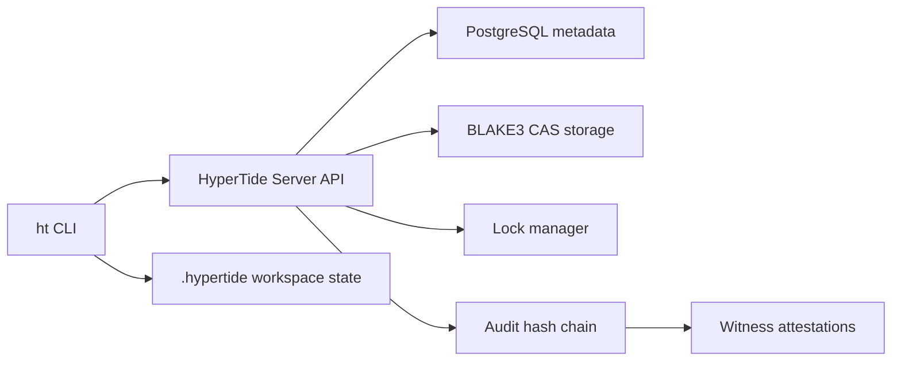

<div align="center">

# HyperTide

**Open-source version control for large binary assets with centralized truth and audit-ready trust chains.**

[](https://github.com/openLYURA/HyperTide/actions/workflows/ci.yml)
[](https://github.com/openLYURA/HyperTide/releases)
[](LICENSE)
[](https://www.rust-lang.org/)
[](deploy/server/README.md)

[Quick Start](#quick-start) ·
[CLI](docs/cli/README.md) ·
[Status](STATUS.md) ·
[Server](docs/server/README.md) ·
[OpenAPI](docs/api/openapi.yaml) ·
[Self Hosting](docs/operations/self-hosting.md) ·
[Security](SECURITY.md) ·
[中文](README_CN.md)

</div>

## What Is HyperTide?

HyperTide is a self-hostable version control core for game content, art files, build outputs, and other large binary assets that do not fit well in Git. It keeps repo, branch, lock, changeset, checkpoint, and audit state on the server while the CLI manages local workspace state under `.hypertide/`.

The Community Edition is open source and focused on the Server + CLI workflow. It does not include a public desktop or web UI.

## Features

- **Content-addressable binary storage** — CAS storage with BLAKE3 hashing, deduplication, and atomic writes.
- **Server-side repo and branch truth** — Explicit repo initialization, server-owned branch heads, and stale submission rejection.
- **File locking with leases** — Owner checks, renewals, forced unlock audit trails, and lock-aware submit protection.
- **Changeset lifecycle** — Draft, approve, promote, rollback, log, sync, and checkout flows for controlled asset history.
- **Audit and witness layer** — Hash-chain audit records, checkpoint attestations, and structured witness configuration.
- **Agent-native checkpoints** — Sessions and checkpoints for recoverable AI-assisted asset workflows.
- **Production-oriented self hosting** — Docker Compose deployment, health checks, metrics, rate limiting, and graceful shutdown.

## Quick Start

Download the precompiled CLI from [GitHub Releases](https://github.com/openLYURA/HyperTide/releases) first when a package is available for your platform. Source builds are the fallback path:

```bash
git clone https://github.com/openLYURA/HyperTide.git
cd HyperTide
cargo build --release

docker compose -f deploy/server/docker-compose.yml --env-file deploy/server/.env.example up -d

target/release/ht login --server http://localhost:3000 --token dev-master-key
target/release/ht init --repo my-repo
target/release/ht doctor

target/release/ht add --file Content/Props/tree.uasset
target/release/ht status
target/release/ht submit --message "update tree prop"
```

For a guided walkthrough, see [Getting Started](docs/getting-started.md). For first-time CLI file operations, see the [CLI User Guide](docs/cli/user-guide.md). For production deployment, see [Self Hosting](docs/operations/self-hosting.md).

## Why HyperTide?

| | Git | Git LFS | Perforce | **HyperTide** |
|---|---|---|---|---|
| Large binary files | Poor | OK | Good | **Excellent** |
| File locking | No | No | Yes | **Yes** |
| Approval workflows | No | No | Limited | **Gate, approve, promote** |
| Audit chain | No | No | Basic | **BLAKE3 hash chain + witnesses** |
| Agent support | No | No | No | **Sessions + checkpoints** |
| Self-hosted | Yes | Yes | Expensive | **Docker Compose first** |
| Open source core | Yes | Yes | No | **MIT** |

## Architecture



The server is the source of truth for repo, branch, changeset, lock, audit, session, and checkpoint state. The CLI translates local workspace actions into API calls and keeps only client-side cache and staging metadata locally.

## Community vs Enterprise

HyperTide Community Edition contains the open source Server and CLI, Docker Compose deployment assets, OpenAPI documentation, and the basic trust/audit/witness layer.

HyperTide Enterprise is a separate commercial distribution built on top of the public extension points. Advanced identity, RBAC/ABAC, compliance exports, cloud or hardware-backed witness integrations, managed deployment support, SLA support, and private UI experiments are not part of this public Community Edition repository.

## Documentation

- [Getting Started](docs/getting-started.md) — 5-minute local walkthrough.
- [CLI User Guide](docs/cli/user-guide.md) — First-time file operation workflow.
- [CLI Reference](docs/cli/README.md) — Commands, flags, examples, and troubleshooting.
- [Server Guide](docs/server/README.md) — Server configuration, API keys, and operations.
- [Project Status](STATUS.md) — Current preview scope and roadmap boundary.
- [Support](SUPPORT.md) — Community support channels and issue guidance.
- [Self Hosting](docs/operations/self-hosting.md) — Docker Compose production deployment.
- [Operations Runbook](docs/operations/runbook.md) — Backup, restore, rollback, and incident response.
- [Architecture](docs/architecture.md) — System design and data flow.
- [OpenAPI Spec](docs/api/openapi.yaml) — REST API contract.
- [Contributing](CONTRIBUTING.md) — Contribution workflow.
- [Security](SECURITY.md) — Private vulnerability reporting.

## Development

```bash
cargo fmt --all -- --check
cargo check --workspace
cargo clippy --workspace -- -D warnings
cargo test --workspace
```

## Contributing

Contributions are welcome. Start from [CONTRIBUTING.md](CONTRIBUTING.md), keep changes focused, and include tests for behavior changes.

## Security

Report security issues privately via [SECURITY.md](SECURITY.md). Do not disclose vulnerabilities publicly before maintainers have had a chance to respond.

## License

[MIT](LICENSE)
