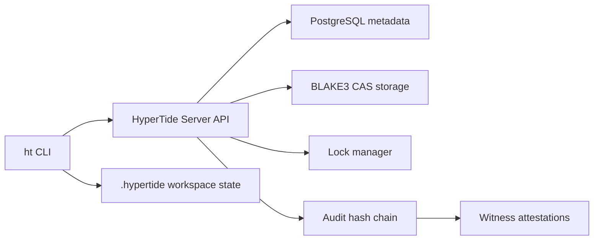

<div align="center">

# HyperTide

**面向大型二进制资产的开源版本控制核心：服务端真相源、可审计信任链、CLI 优先工作流。**

[](https://github.com/openLYURA/HyperTide/actions/workflows/ci.yml)
[](https://github.com/openLYURA/HyperTide/releases)
[](LICENSE)
[](https://www.rust-lang.org/)
[](deploy/server/README.md)

[快速开始](#快速开始) ·
[CLI](docs/cli/README.md) ·
[状态](STATUS.md) ·
[Server](docs/server/README.md) ·
[OpenAPI](docs/api/openapi.yaml) ·
[自托管](docs/operations/self-hosting.md) ·
[安全](SECURITY.md) ·
[English](README.md)

</div>

## HyperTide 是什么？

HyperTide 是一个可自托管的版本控制核心，面向游戏资源、美术文件、构建产物等不适合 Git 管理的大型二进制资产。它把 repo、branch、lock、changeset、checkpoint、audit 等状态放在服务端维护，CLI 则负责本地 `.hypertide/` 工作区状态和提交流程。

Community Edition 是开源版本，边界聚焦在 Server + CLI。公开仓库不包含桌面或 Web UI。

## 功能特性

- **内容寻址二进制存储** — CAS 存储、BLAKE3 哈希、去重和原子写入。
- **服务端 repo/branch 真相源** — 显式 repo 初始化、服务端分支头、过期提交拒绝。
- **带租约的文件锁** — owner 校验、续租、强制解锁审计和提交保护。
- **Changeset 生命周期** — draft、approve、promote、rollback、log、sync、checkout 组成受控资产历史。
- **审计与见证层** — 哈希链审计记录、checkpoint attestations、结构化 witness 配置。
- **Agent 原生 checkpoint** — session 与 checkpoint 支持可恢复的 AI 辅助资产工作流。
- **面向生产自托管** — Docker Compose 部署、健康检查、metrics、rate limit、graceful shutdown。

## 快速开始

如果 [GitHub Releases](https://github.com/openLYURA/HyperTide/releases) 已提供与你的平台匹配的预编译 CLI，请优先下载使用。源码构建作为 fallback：

```bash
git clone https://github.com/openLYURA/HyperTide.git
cd HyperTide
cargo build --release

docker compose -f deploy/server/docker-compose.yml --env-file deploy/server/.env.example up -d

target/release/ht login --server http://localhost:3000 --token dev-master-key
target/release/ht init --repo my-repo
target/release/ht doctor

target/release/ht add --file Content/Props/tree.uasset
target/release/ht status
target/release/ht submit --message "update tree prop"
```

完整上手流程见 [Getting Started](docs/getting-started.md)。首次使用 CLI 做文件操作，请看 [CLI 用户指南](docs/cli/user-guide.md)。生产部署见 [Self Hosting](docs/operations/self-hosting.md)。

## 为什么选择 HyperTide？

| | Git | Git LFS | Perforce | **HyperTide** |
|---|---|---|---|---|
| 大型二进制文件 | 差 | 一般 | 好 | **优秀** |
| 文件锁 | 无 | 无 | 有 | **有** |
| 审批工作流 | 无 | 无 | 有限 | **Gate、approve、promote** |
| 审计链 | 无 | 无 | 基础 | **BLAKE3 哈希链 + witness** |
| Agent 支持 | 无 | 无 | 无 | **Session + checkpoint** |
| 自托管 | 是 | 是 | 昂贵 | **Docker Compose 优先** |
| 开源核心 | 是 | 是 | 否 | **MIT** |

## 架构



服务端是 repo、branch、changeset、lock、audit、session、checkpoint 状态的真相源。CLI 将本地工作区操作转换成 API 请求，本地只保存缓存、暂存区和工作区元数据。

## Community 与 Enterprise 边界

HyperTide Community Edition 包含开源 Server、CLI、Docker Compose 部署资产、OpenAPI 文档，以及基础 trust/audit/witness 能力。

HyperTide Enterprise 是基于公开扩展点构建的独立商业发行版。高级身份集成、RBAC/ABAC、合规导出、云或硬件 witness 集成、托管部署支持、SLA 支持，以及私有 UI 实验，都不属于公开 Community Edition 仓库。

## 文档

- [Getting Started](docs/getting-started.md) — 5 分钟本地上手。
- [CLI 用户指南](docs/cli/user-guide.md) — 面向第一次使用的文件操作全链路。
- [CLI Reference](docs/cli/README.md) — 命令、参数、示例和排错。
- [Server Guide](docs/server/README.md) — 服务端配置、API Key 和运维说明。
- [项目状态](STATUS.md) — 当前 preview 范围与 roadmap 边界。
- [支持](SUPPORT.md) — 社区支持渠道与 Issue 指南。
- [Self Hosting](docs/operations/self-hosting.md) — Docker Compose 生产部署。
- [Operations Runbook](docs/operations/runbook.md) — 备份、恢复、回滚和故障处理。
- [Architecture](docs/architecture.md) — 系统设计和数据流。
- [OpenAPI Spec](docs/api/openapi.yaml) — REST API 契约。
- [Contributing](CONTRIBUTING.md) — 贡献流程。
- [Security](SECURITY.md) — 私有漏洞报告。

## 开发

```bash
cargo fmt --all -- --check
cargo check --workspace
cargo clippy --workspace -- -D warnings
cargo test --workspace
```

## 贡献

欢迎贡献。请先阅读 [CONTRIBUTING.md](CONTRIBUTING.md)，保持改动聚焦，并为行为变更补充测试。

## 安全

请通过 [SECURITY.md](SECURITY.md) 私下报告安全问题。在维护者响应前，请不要公开披露漏洞细节。

## 许可证

[MIT](LICENSE)
